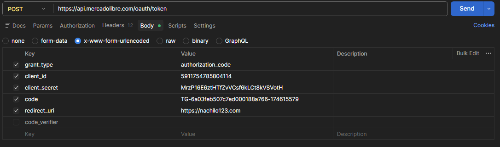

Mercado Libre API - Búsqueda de Productos (Gestor de Inventario)
Este módulo de automatización en Playwright permite consultar productos en Mercado Libre México (MLM) para el monitoreo de precios y disponibilidad de artículos coleccionables como Pokémon TCG y Monster High.

⚠️ Desafío Técnico: Bloqueo por CAPTCHA
Al realizar peticiones directas (sin autenticación) al endpoint de búsqueda, el sistema de seguridad de Mercado Libre intercepta la solicitud y devuelve un desafío de CAPTCHA o un error 403 Forbidden.

Diagnóstico de QA
Síntoma: Error 403 o redirección a validación visual en el navegador.

Posible causa causa: Medidas anti-bot para prevenir el scraping no autorizado.

Solución Implementada: Autenticación oficial vía OAuth 2.0 utilizando un access_token de aplicación.

Con ellos y debido al poco tiempo de vida del token tampoco dio respuesta el servicio.